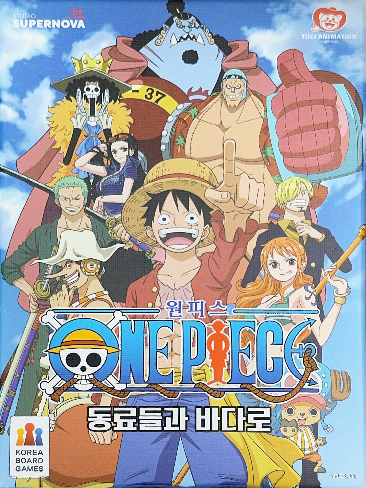
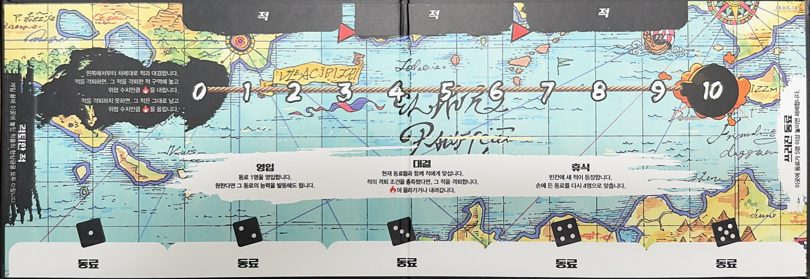
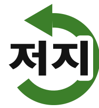

# 원피스 보드게임 — 동료들과 바다로 (One Piece: To the Sea with Your Crewmates)



Digitized card data for the One Piece cooperative board game "동료들과 바다로," published by Studio Supernova / Korea Board Games under license from Toei Animation. This repo holds scanned card images, board/box photos, and CSV extractions (Korean text + English translation) for each card type.

## Card Wiki (`index.html`)

A small website for looking things up mid-game: search or filter by episode/enemy-boss, toggle Korean/English/both, click a card for the full-size art and complete ability text with the keyword icons rendered inline.

**Live at:** https://elfboy6000.github.io/one-piece-boardgame/ (via GitHub Pages, once enabled — see below).

It reads the 3 CSVs client-side on page load, so any edit you push to a CSV to fix a card name/translation shows up automatically — no rebuild step, just refresh.

A fourth tab, **Game Tracker**, lets you track a session in progress: 3 slots for the enemies/bosses currently in play, 5 slots for recruited crewmates, and an open-ended hand of crewmate cards. Click an empty slot to search and pick a card (thumbnail + name, searchable in either language); click a filled slot to reopen its full detail (art + ability text); click the ✕ to clear it. The tracker state is saved in your browser's local storage, so it survives a refresh — but it's per-browser/per-device only (not shared between players or devices), and "Reset tracker" wipes it for a new game.

### Enabling GitHub Pages (one-time)

1. Push this repo to GitHub (`git push`).
2. On GitHub: **Settings → Pages**.
3. Under "Build and deployment", set **Source** to "Deploy from a branch".
4. Set **Branch** to `main` and folder to `/ (root)`, then **Save**.
5. GitHub gives you a URL like `https://<username>.github.io/<repo>/` — that's your live wiki, updated a minute or two after every push to `main`.

Note: opening `index.html` by double-clicking it (a `file://` URL) will **not** work — browsers block a local page from loading local CSV/image files that way. Either use the GitHub Pages URL above, or if you want to preview a change before pushing, run any static file server locally (e.g. `python3 -m http.server` from the project folder) and open the printed `localhost` URL.

## Repo layout

```
index.html        The card wiki (see above)
assets/           Its CSS/JS (csv.js parses the CSVs, app.js renders everything)
Board/
  box_cover.jpg   Retail box art
  game_board.jpg  The turn-order lane on the game board
Icons/
  swap_gyohwan.svg, move_idong.svg, powerup.svg, recruit_yeongip.svg, prevent_jeoji.svg
Cards/
  Characters/   10 character cards (+ card back) — characters.csv
  Enemies/      26 enemy + 10 boss cards (+ card back) — enemies.csv
  Crewmates/    54 crewmate cards (+ card back) — crewmates.csv
```



Each `.jpg` is named after the English name of the character/card it depicts, and each folder's CSV cross-references the image via a `jpg_reference` column, alongside the Korean name/text, an English translation, and relevant stats (Power, Threat, Bounty, etc.).

Some `crewmates.csv` rows are minor/background characters whose names could not be confidently read off the card art (nameplates are stylized Korean text) — these are marked `미확인` (unidentified) with a `notes` column explaining why, and are named `Unidentified_*.jpg`. Feel free to correct these once you have the physical cards in hand.

## Game overview

A cooperative pirate-adventure game for multiple players. Everyone shares one goal: defeat enemies and gather crewmates together before the shared **Flame** (danger meter) fills up. Reach the end of the enemy deck and your combined bounty crowns you with a pirate title, from 평범한 나부랭이 (Ordinary Nobody) all the way up to 사황 (Yonko/Emperor).

## Components

- **캐릭터 카드 (Character cards, 10)** — each player picks one to represent them (Luffy, Zoro, Nami, Usopp, Sanji, Chopper, Robin, Franky, Brook, Jinbe). Each has a unique ability keyed off the [Die].
- **동료 카드 (Crewmate cards, 54)** — the cards you recruit into your hand/board. Each shows a **Power** number, and often an ability (a keyword like Move/Swap/Recruit/Power Up!, or custom text). Grouped into 6 "episodes" (story arcs) of 9 cards each: Alabasta, Marineford, Revolutionary Army, Dressrosa, Whole Cake Island, Wano Country.
- **적 카드 (Enemy cards, 26)** — each shows a **Threat** value (the Flame number needed to face it), a **defeat condition** (a combinatorial condition on your crewmates' Power/colour), and a **bounty** reward for defeating it.
- **보스 카드 (Boss cards, 10)** — harder enemies used in the Boss Rush variant; each has an extra "On Reveal" (등장) effect that triggers immediately when flipped, on top of its defeat condition.
- **Tokens**: 주사위 (die), 위협 토큰 (threat token), 파워업/파워다운 토큰 (Power Up!/Power Down token — also marks "ability used").

## Turn structure (clockwise)

1. **영입 Recruit** — recruit 1 crewmate. Draw the top crewmate card and place it face up in front of you; you may activate that crewmate's ability immediately if you want.
2. **대결 Duel** — face the current enemies with your current crewmates, left to right. If you meet an enemy's defeat condition, defeat it: move it to the defeated-enemy area and **lower the Flame by its Threat value**. If you fail to defeat it, it stays and you instead **raise the Flame by its Threat value**.
3. **휴식 Rest** — a new enemy appears in any empty enemy space, and you refill your hand back up to 4 crewmates.

## Ability keyword vocabulary

These 5 keywords are printed on cards as a small icon + label (see `Icons/`). In the CSVs, every occurrence of the keyword (Korean and English) is wrapped in square brackets — e.g. `[이동]` / `[Move]` — precisely so you can find/replace that exact bracketed token with an `` tag (or equivalent) for the icon. See [Icon reference](#icon-reference-for-text-replacement) below for the exact tokens and image paths.

| Icon | Keyword | Effect |
|---|---|---|
|  | 교환 Swap | Trade a chosen crewmate card with another player's chosen crewmate. |
|  | 이동 Move | Choose a crewmate card, move it to any crewmate space. |
|  | 파워업! Power Up! | Place a Power Up token on a crewmate (+1 Power each, stackable). |
|  | 영입 Recruit | Immediately trigger a hand crewmate's ability. |
|  | 저지 Prevent | Cancel an enemy (or boss) card's ability/condition from activating. |

Two more inline symbols appear throughout the ability text but aren't part of this 5-icon set: 🔥 (the Flame/threat meter, written `[불꽃]`/`[Flame]`) and 🎲 (the die roll, written `[주사위]`/`[Die]` or the 🎲 emoji directly).

## Setup

Each player picks 1 character (Luffy included by default) and gets 7 Power Up tokens. Shuffle the 26 enemy cards face down (mixing in boss cards for the Boss Rush variant) and reveal the leftmost 3 enemy spaces. Shuffle the full 54-card crewmate deck and deal to the board's crewmate spaces plus each player's starting hand. The Flame/threat token starts at 0.

## End conditions

1. **패배 Defeat** — if the "fallen crewmate" area ever reaches 5+ cards, everyone loses (no bounty counted).
2. **Deck depletion** — if the crewmate deck runs out when a draw is needed, the game ends.
3. **해적왕! Pirate King** — defeat every card in the enemy deck to win. Your final title is based on the combined bounty of every enemy you defeated:

   | Bounty | Title |
   |---|---|
   | 0 – 10,000,000 | 평범한 나부랭이 Ordinary Nobody |
   | 11,000,000 – 20,000,000 | 조무래기 해적 Petty Pirate |
   | 21,000,000 – 30,000,000 | 이스트 블루 해적 East Blue Pirate |
   | 31,000,000 – 40,000,000 | 위대한 항로 해적 Grand Line Pirate |
   | 41,000,000 – 50,000,000 | 대해적 Great Pirate |
   | 51,000,000 – 60,000,000 | 최악의 세대 Worst Generation |
   | 61,000,000 – 70,000,000 | 칠무해 Shichibukai |
   | 71,000,000+ | 사황 Yonko/Emperor |

## Variants

- **보스 러시 Boss Rush** — mix boss cards into the enemy deck before shuffling for a harder game; abilities that say "적" (enemy) only affect a boss if they explicitly say "보스."
- **솔로 모드 Solo mode** — single player uses a fixed 6-card hand instead of the normal draw; enemy effects target your own character; Swap/Move/Recruit abilities get reworded to target yourself.

## Icon reference (for text replacement)

The 3 CSVs never embed images directly — instead, every mention of one of the 5 ability keywords is wrapped in square brackets as plain text. To render icons instead of text, do a literal find/replace of each bracketed token below with an image tag pointing at the corresponding file in `Icons/`.

| Token (Korean) | Token (English) | Icon file |
|---|---|---|
| `[교환]` | `[Swap]` | `Icons/swap_gyohwan.svg` |
| `[이동]` | `[Move]` | `Icons/move_idong.svg` |
| `[파워업]` | `[Power Up!]` | `Icons/powerup.svg` |
| `[영입]` | `[Recruit]` | `Icons/recruit_yeongip.svg` |
| `[저지]` | `[Prevent]` | `Icons/prevent_jeoji.svg` |

Example (HTML): replacing `[Move]` with `` turns

> `[Move] up to [Die] times.`

into an inline icon followed by the rest of the sentence. Since the replacement is a plain literal string match, it works the same way in a spreadsheet find/replace, a script, or a templating engine.

**Note:** the character name 저지 (Jesus Burgess, in `Enemies/enemies.csv` and `Crewmates/crewmates.csv`) is deliberately left unbracketed — only the verb usage of 저지 (e.g. "저지합니다") was wrapped as `[저지]`, so the character's name is never mistaken for the Prevent icon.

## Terminology reference (for future extractions)

| Korean | English |
|---|---|
| 동료 | Crewmate |
| 적 | Enemy |
| 보스 | Boss |
| 현상금 | Bounty |
| 위협 | Threat |
| 격퇴 조건 | Defeat condition |
| 파워 | Power |
| 🔥 | Flame |
| 🎲 | Die |
